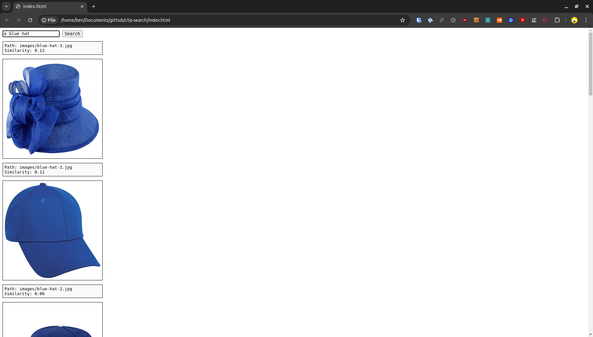

# clip-search

A small project showing how to do text-to-image search with [OpenCLIP](https://github.com/mlfoundations/open_clip), Docker, Flask, Faiss, etc.

```bash
pip install -r requirements.txt # install Python requirements
python get_model_files.py # download OpenCLIP model
python create_index.py # create index from image features
# Open Docker desktop, then:
docker build -t clip-search -f docker/Dockerfile . # build Docker image
docker run -p 4000:5000 clip-search # run Docker container
# In another terminal:
curl -X POST -H "Content-Type: application/json" -d '{"text":"red hat"}' http://localhost:4000/lookup # send request to Docker container
```

There is also a basic front-end in the `frontend` directory. With the Docker container running, open the `frontend/index.html` file in a browser and type your search in the text box.


